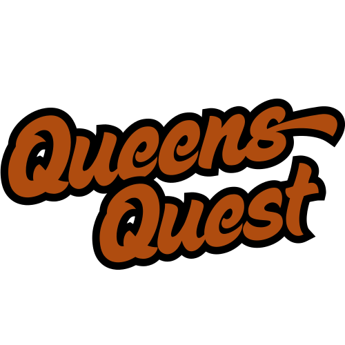

# 👑 QueensQuest

<div align="center">



**A modern, interactive N-Queens puzzle game built for Reddit with React, TypeScript, and Devvit**

[](https://opensource.org/licenses/MIT)
[](https://www.typescriptlang.org/)
[](https://reactjs.org/)
[](https://tailwindcss.com/)
[](https://devvit.io/)

</div>

## 🎮 About

QueensQuest is an engaging N-Queens puzzle game designed specifically for Reddit communities. Players must strategically place queens on a chessboard so that no two queens can attack each other. The game features multiple modes, progressive difficulty, and a streak system to keep players engaged.

### ✨ Key Features

- 🎯 **Progressive Difficulty**: Start at 6x6 and advance to larger boards as you complete puzzles
- 🔥 **Streak System**: Track your maximum completed board size
- ⏰ **Daily Challenges**: Special timed puzzles with unique rewards
- 🎵 **Immersive Audio**: Background music and sound effects for each game mode
- 📱 **Responsive Design**: Optimized for both desktop and mobile devices
- 🎨 **Modern UI**: Beautiful animations and smooth interactions
- 🔄 **Session Persistence**: Your progress is saved across sessions
- 🎊 **Celebration Effects**: Confetti animations when you complete puzzles
- 📤 **Social Sharing**: Share your achievements on X (Twitter) and Reddit

## 🚀 Quick Start

### Prerequisites

- Node.js 18+ 
- npm or yarn
- Devvit CLI

### Installation

1. **Clone the repository**
   ```bash
   git clone https://github.com/jishanahmed-shaikh/queensquest.git
   cd queensquest
   ```

2. **Install dependencies**
   ```bash
   npm install
   ```

3. **Start development server**
   ```bash
   npm run dev
   ```

4. **Build for production**
   ```bash
   npm run build
   ```

## 🎯 Game Modes

### 🏠 Main Game
- Start with a 6x6 board
- Complete puzzles to unlock larger boards (7x7, 8x8, etc.)
- Track your maximum streak
- No time pressure - play at your own pace

### ⏰ Daily Challenge
- 30-second time limit
- One challenge per day
- Special completion rewards
- Test your skills under pressure

## 🎮 How to Play

1. **Place Queens**: Click on squares to place queens
2. **Avoid Conflicts**: No two queens can be in the same row, column, or diagonal
3. **Complete the Board**: Place the correct number of queens for the board size
4. **Advance**: Successfully completing a board unlocks the next size
5. **Track Progress**: Your maximum streak is displayed on the home screen

## 🛠️ Technical Stack

### Frontend
- **React 18** - Modern UI framework
- **TypeScript** - Type-safe development
- **Tailwind CSS** - Utility-first styling
- **Vite** - Fast build tool and dev server

### Backend
- **Devvit** - Reddit app framework
- **Node.js** - Serverless backend
- **Redis** - Data persistence

### Audio & Assets
- **HTML5 Audio API** - Background music and sound effects
- **SVG Graphics** - Scalable, fast-loading images
- **CSS Animations** - Smooth transitions and effects

## 📁 Project Structure

```
queensquest/
├── src/
│   ├── client/                 # Frontend React app
│   │   ├── components/         # Reusable UI components
│   │   ├── hooks/             # Custom React hooks
│   │   ├── public/            # Static assets
│   │   └── App.tsx            # Main application component
│   ├── server/                # Backend API
│   │   ├── core/              # Core game logic
│   │   └── index.ts           # Server entry point
│   └── shared/                # Shared types and utilities
│       ├── types/             # TypeScript type definitions
│       └── utils/             # Shared utility functions
├── assets/                    # Game assets
├── dist/                      # Built application
└── tools/                     # Build configuration
```

## 🎵 Audio System

The game features a comprehensive audio system:

- **Background Music**: Different tracks for each game mode
  - 🏠 Home: Landing Page BGM
  - 🎮 Main Game: Main Game BGM  
  - ⏰ Daily Challenge: Daily Challenge BGM
- **Sound Effects**:
  - 🔊 Click: Queen placement sound
  - 🎊 Puzzle Complete: Victory sound
  - 💥 Lose: Failure sound

## 🎨 UI/UX Features

- **Responsive Design**: Works on all screen sizes
- **Smooth Animations**: CSS transitions and keyframe animations
- **Loading States**: Proper loading indicators
- **Error Handling**: Graceful fallbacks for failed operations
- **Accessibility**: Keyboard navigation and screen reader support

## 🔧 Configuration

### Environment Variables

Create a `.env` file in the root directory:

```env
# Reddit API Configuration
REDDIT_CLIENT_ID=your_client_id
REDDIT_CLIENT_SECRET=your_client_secret
REDDIT_REDIRECT_URI=your_redirect_uri

# Redis Configuration
REDIS_URL=your_redis_url
```

### Game Settings

Modify game settings in `src/shared/types/queens.ts`:

```typescript
export const GAME_CONFIG = {
  MIN_BOARD_SIZE: 4,
  MAX_BOARD_SIZE: 12,
  DEFAULT_BOARD_SIZE: 6,
  DAILY_CHALLENGE_TIME_LIMIT: 30, // seconds
};
```

## 🚀 Deployment

### Reddit App Deployment

1. **Build the application**
   ```bash
   npm run build
   ```

2. **Deploy with Devvit**
   ```bash
   devvit deploy
   ```

3. **Configure subreddit settings**
   - Set up app permissions
   - Configure webhook endpoints
   - Test in your subreddit

## 🧪 Testing

```bash
# Run linting
npm run lint

# Run type checking
npm run type-check

# Run tests (if available)
npm test
```

## 📊 Performance

- **Fast Loading**: Optimized assets and lazy loading
- **Memory Efficient**: Proper cleanup of intervals and event listeners
- **Responsive**: 60fps animations and smooth interactions
- **Offline Ready**: Service worker support for caching

## 🤝 Contributing

We welcome contributions! Please follow these steps:

1. **Fork the repository**
2. **Create a feature branch**
   ```bash
   git checkout -b feature/amazing-feature
   ```
3. **Commit your changes**
   ```bash
   git commit -m 'Add amazing feature'
   ```
4. **Push to the branch**
   ```bash
   git push origin feature/amazing-feature
   ```
5. **Open a Pull Request**

### Development Guidelines

- Follow TypeScript best practices
- Use meaningful commit messages
- Add comments for complex logic
- Test on multiple devices
- Ensure accessibility compliance

## 📝 Changelog

See [LOG.md](LOG.md) for detailed development history and recent changes.

## 🐛 Known Issues

- **Cheeky Feature**: Boards may occasionally shuffle mid-game (intentional feature for added challenge!)
- **Mobile Scrolling**: Some devices may require minimal scrolling on the home page

## 🔮 Future Features

- [ ] Multiplayer mode
- [ ] Leaderboards
- [ ] Custom board themes
- [ ] Hint system
- [ ] Achievement badges
- [ ] Tournament mode

## 📄 License

This project is licensed under the MIT License - see the [LICENSE](LICENSE) file for details.

## 🙏 Acknowledgments

- **Reddit** for the amazing platform
- **Devvit** for the powerful app framework
- **React Team** for the excellent framework
- **Tailwind CSS** for the utility-first approach
- **All Contributors** who helped make this project better

## 📞 Support

- 🐛 **Bug Reports**: [Open an issue](https://github.com/jishanahmed-shaikh/queensquest/issues)
- 💡 **Feature Requests**: [Start a discussion](https://github.com/jishanahmed-shaikh/queensquest/discussions)
- 💬 **Community**: Join our [Discord server](https://discord.gg/your-invite)

---

<div align="center">

**Made with ❤️ for the Reddit community**

[⭐ Star this repo](https://github.com/jishanahmed-shaikh/queensquest) • [🐛 Report Bug](https://github.com/jishanahmed-shaikh/queensquest/issues) • [💡 Request Feature](https://github.com/jishanahmed-shaikh/queensquest/issues)

</div>
